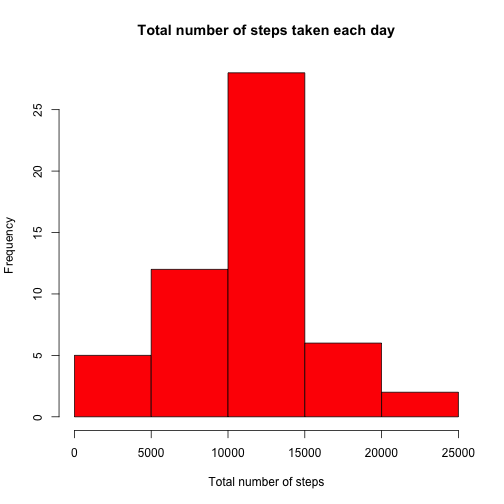
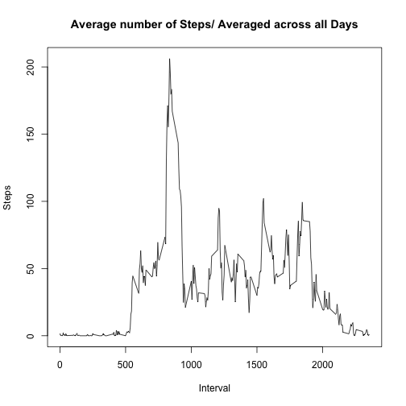
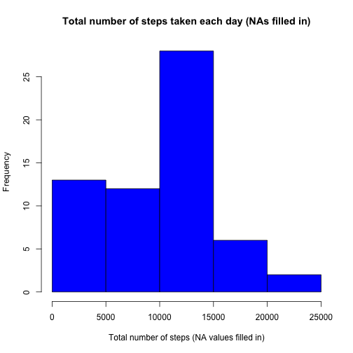
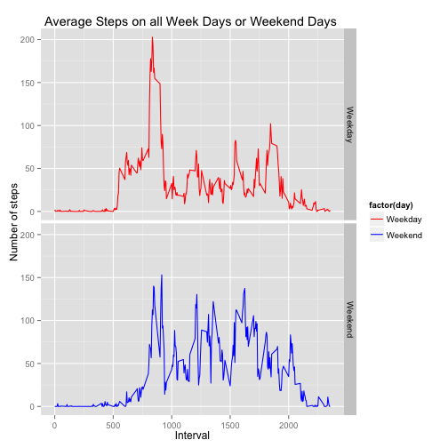

library(dplyr)
library(ggplot2)


##Loading and preprocessing of data##

```r
    if(!file.exists("activity.csv")) {
    fileUrl <- "https://d396qusza40orc.cloudfront.net/repdata%2Fdata%2Factivity.zip?accessType                =DOWNLOAD"
    download.file(fileUrl, destfile = "repdata-data-activity.zip", method = "curl")
    unzip("repdata-data-activity.zip")}
    
    df <- read.csv("activity.csv", stringsAsFactors=FALSE, header=TRUE)
    df1 <- na.omit(df)
```
    
    
##What is mean total number of steps taken per day?##

**1. Calculate the total number of steps taken per day**

```r
library(dplyr)
dfsum <- summarize(group_by(df1, date), sum(steps))
names(dfsum) <- c("date", "steps")
```


**2. Make a histogram of the total number of steps taken each day**

```r
    hist(dfsum$steps, xlab = "Total number of steps", col = 'Red',   
         main = "Total number of steps taken each day")
```

 
[id]: figures/plot1.png "Histogram" 


**3. Calculate and report the mean and median of the total number of steps taken per day**

```r
    library(dplyr)
    dfsum%>%dplyr::summarise(Mean=mean(steps), Median=median(steps))%>%
    print
```

```
## Source: local data frame [1 x 2]
## 
##       Mean Median
## 1 10766.19  10765
```

##What is the average daily activity pattern?##

```r
    dfavg <- dplyr::summarize(group_by(df1, interval), mean(steps))
    names(dfavg) <- c("interval", "steps")
```

**1. Time series plot of the 5-minute interval and the average number of steps taken, 
   averaged across all days**

```r
    plot(dfavg$interval, dfavg$steps, xlab = "Interval", ylab = "Steps", type = "l",
         main = "Average number of Steps/ Averaged across all Days")
```

 

**2. Which 5-minute interval, on average across all the days in the dataset, contains the maximum number of steps?**

```r
    num <- dfavg[dfavg$steps %in% max(dfavg$steps),]
```
###The 5 minute interval with the maximum number of steps is 835###         


##Imputing missing values##

**1. Calculate and report the total number of missing values in the dataset**


```r
    miss <- length(which(is.na(df$steps)))

#2.  Devise a strategy for filling in all of the missing values in the dataset. 
    dfnew <- df
    dfnew$steps[is.na(dfnew$steps)] <- median(dfnew$steps, na.rm=TRUE)

#3. Create a new dataset that is equal to the original dataset but with the missing data filled 
#   in
    dfnewsum <- dplyr::summarize(group_by(dfnew, date), sum(steps))
    names(dfnewsum) <- c("date", "steps")
```


**4a. Make a histogram of the total number of steps taken each day (with imputed NA values)**

```r
    hist(dfnewsum$steps, xlab = "Total number of steps (NA values filled in)", col = 'Blue',   
         main = "Total number of steps taken each day (NAs filled in)")
```

 


**4b. Calculate and report the mean and median of the total number of steps taken per day after imputing NAs**

```r
    dfnewsum%>%
        dplyr::summarise(Mean=mean(steps), Median=median(steps))%>%
        print
```

```
## Source: local data frame [1 x 2]
## 
##      Mean Median
## 1 9354.23  10395
```
###The Mean and Median values are slightly lower (than in the first part) after computation including imputed missing values###

##Are there differences in activity patterns between weekday and weekends##  

**1. Create a new factor variable in the dataset with two levels – 
“weekday” and “weekend” indicating whether a given date is a weekday or weekend day**


```r
    dfnew$days <- factor(weekdays(as.Date(dfnew$date)))
    l1 <- ifelse(dfnew$days=="Monday" | dfnew$days=="Tuesday" | dfnew$days=="Wednesday" |
                  dfnew$days== "Thursday" | dfnew$days== "Friday", "Weekday", 
                          ifelse(dfnew$days=="Saturday" |  dfnew$days=="Sunday", "Weekend", "End"))
                                    
     dfnew <- cbind(dfnew, l1)                               
     dffin <- dplyr::summarize(group_by(dfnew, interval, l1), mean(steps))
     names(dffin) <- c("interval", "day", "steps")     
```
**2. Panel plot containing a time series plot (i.e. type = "l") of the 5-minute interval (x-axis) and the average number of steps taken, averaged across all weekday days or weekend days**

```r
    library(ggplot2)
    ggplot(dffin, aes(x = interval, y = steps, color=factor(day))) +
        geom_line() +  xlab('Interval') + ylab('Number of steps') +
        facet_grid(day~.) + scale_color_manual(values=c("red", "blue")) +
        labs(title = 'Average Steps on all Week Days or Weekend Days ')
```

 

